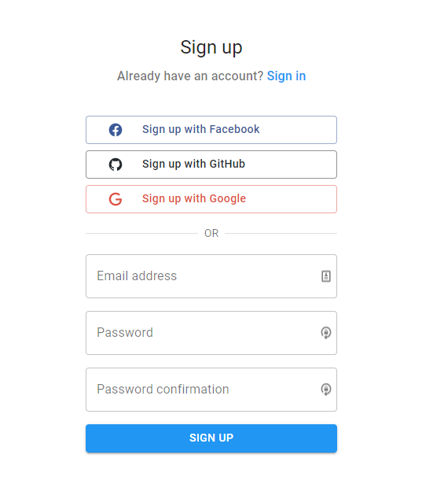
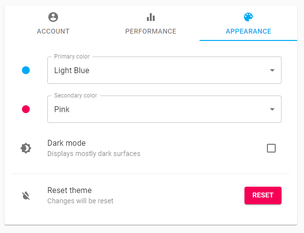
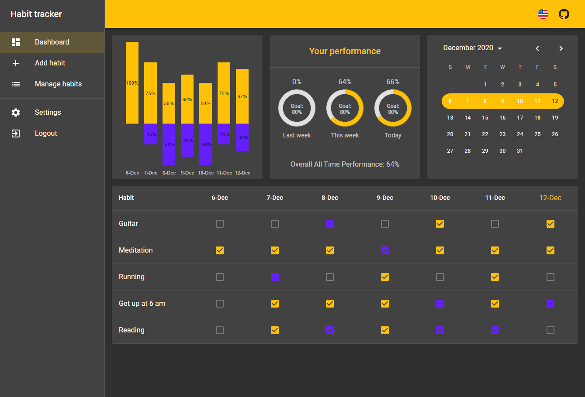

# Habit Tracker

## About
 Tracking of habits 

## Features and Stack

### Features
* create an account with using email and password
* authenticate using Facebook, GitHub or Google
* login as a guest
* add, edit and delete habits
* mark the habits as `completed`, `failed` or `skipped`
* weekly performance is visualized in a bar chart
* brief summary of performance for last week, current week, current day and all time
* customize the app by changing `primary` and `secondary` color
* toggle dark mode
* choose your language: `ES | EN | PL`

### Stack

* React
* React Query
* React Router
* React Hook Form
* Material UI
* Firebase
  * Authentication
  * Realtime Database
  
## Screenshots

* Landing Page

* Sign up using **Facebook**, **GitHub**, **Google** or create a new account using your email address.

* Create new habit

* Manage your habits - preview, edit or delete your habits

* Keep track of your habits in the Dashboard

* Change your settings

* Customize the app the way you want

